# K230 Image Classification Tutorial

## Introduction

The K230 chip is the latest generation SoC product in Canaan's Kendryte® series of AIoT chips. This chip adopts a new multi-heterogeneous unit accelerated computing architecture, integrating 2 RISC-V high-efficiency computing cores and a new generation KPU (Knowledge Process Unit) intelligent computing unit with multi-precision AI computing power. It widely supports general AI computing frameworks, with utilization rates exceeding 70% for some typical networks.
The chip also features rich and diverse peripheral interfaces, as well as multiple dedicated hardware acceleration units for scalars, vectors, graphics (2D, 2.5D, etc.), capable of performing full-process computing acceleration for various tasks including images, video, audio, AI, and more. It has characteristics such as low latency, high performance, low power consumption, fast startup, and high security.
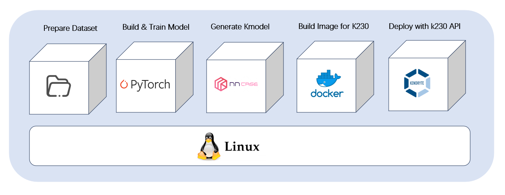
This tutorial will introduce how to train an image classification AI model using PyTorch and convert the model to kmodel format for deployment on the Canaan Kendryte K230 chip.
This process requires basic knowledge of Python and C++ programming, understanding of simple Linux system operations, and some deep learning knowledge, though not mandatory.
This tutorial will cover the entire process from data preparation, model training and testing, K230 image compilation and flashing, C++ sample code compilation to executable files, network configuration and file transfer between PC and K230, to K230 deployment. The operating system is Linux, and the deep learning framework used is PyTorch.
This tutorial uses a vegetable classification scenario as an example project.

## Environment Setup

### GPU Environment

This tutorial assumes that CUDA users have already installed the appropriate graphics card drivers and set up the CUDA environment.

### Installing Anaconda

If anaconda or miniconda is already installed, skip this step.
Anaconda is used to create virtual environments to isolate the PyTorch model training environment from other environments.

```shell
apt-get install -y wget
wget https://repo.anaconda.com/archive/Anaconda3-5.3.0-Linux-x86_64.sh # You can choose a suitable version to install
chmod +x Anaconda3-5.3.0-Linux-x86_64.sh
./Anaconda3-5.3.0-Linux-x86_64.sh
```

The following interface will appear:

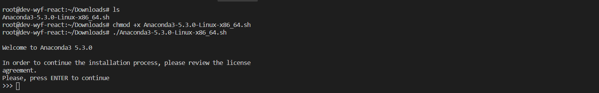

Press Enter

At this point, Anaconda information will be displayed, and "More" will appear. Continue pressing Enter until you see the following:

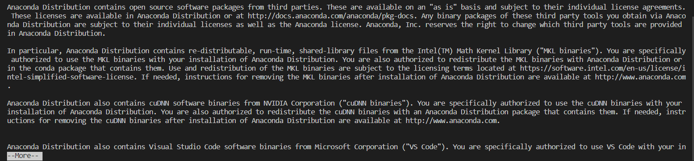

Type yes
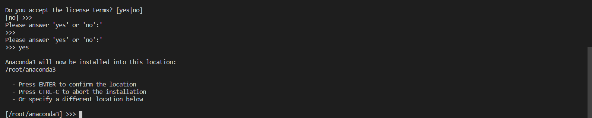

Continue pressing Enter

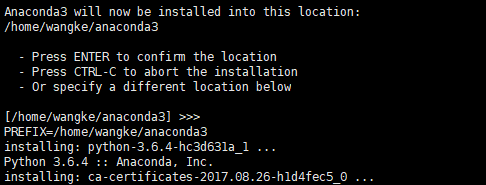

Type yes to add environment variables

Check if the installation was successful:

```shell
conda -V
```

If the conda version is returned, the installation was successful.

### Installing Docker

If Docker is already installed, skip this step.
Docker official and domestic daocloud both provide one-click installation scripts, making Docker installation more convenient.
Official one-click installation method:

```shell
curl -fsSL https://get.docker.com | bash -s docker --mirror Aliyun
```

Domestic daocloud one-click installation command:

```shell
curl -sSL https://get.daocloud.io/docker | sh
```

Execute any of the above commands and wait patiently to complete the Docker installation.

### Creating Model Training Environment

```shell
# Use anaconda to create a virtual environment for model training
conda create -n myenv python=3.9
# Activate the virtual environment
conda activate myenv
# Install Python libraries for training according to requirements.txt in the project, wait for installation
pip install -r requirements.txt
```

The requirements.txt file will install the model conversion packages nncase and nncase-kpu. `nncase is a neural network compiler designed for AI accelerators, see [nncase](https://github.com/kendryte/nncase).

### Installing .NET

```shell
wget https://packages.microsoft.com/config/ubuntu/20.04/packages-microsoft-prod.deb -O packages-microsoft-prod.deb
dpkg -i packages-microsoft-prod.deb
apt update
apt install -y apt-transport-https
apt install -y dotnet-sdk-7.0
```

### Adding nncase Plugin to Environment Variables

***Note: This step needs to be completed according to your actual machine setup. If using an anaconda virtual environment, under the envs directory in the anaconda installation location, select the virtual environment myenv created for training, and under it select lib/python3.9/site-packages/, which is where pip installed nncase and nncase-kpu from requirements.txt. After sourcing, you will exit the current virtual environment and need to activate it again. If using Python directly on the machine, you need to add its lib/python3.9/site_packages/. Control the specific Python version yourself.***

```shell
# Modify the Python installation path according to your actual machine setup
export NNCASE_PLUGIN_PATH=$NNCASE_PLUGIN_PATH:/usr/local/lib/python3.9/site-packages/
export PATH=$PATH:/usr/local/lib/python3.9/site-packages/
source /etc/profile
conda activate myenv
```

## Training Models with Custom Datasets

### Organizing Data

For image classification tasks, organize custom datasets in the following format: the root directory contains subdirectories named by category names, and within each subdirectory are all image samples of that category.
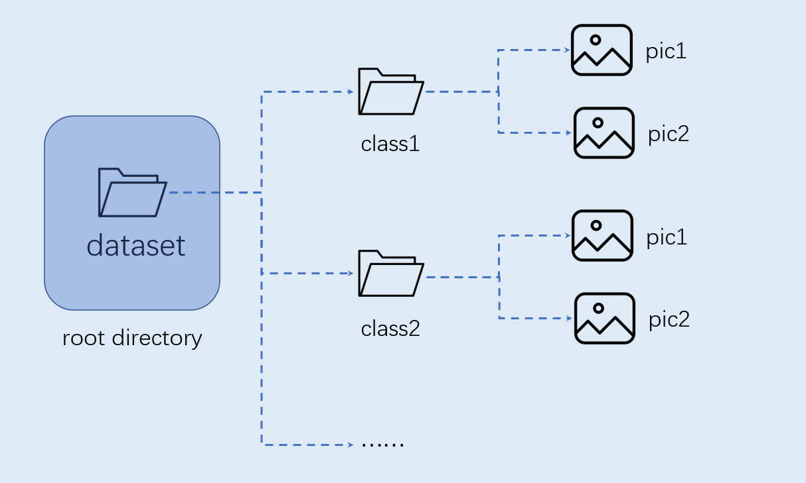

### Configuring Training Parameters

The configuration file config.yaml in the provided training script is set as follows:

```yaml
dataset:
  root_folder: ../data/veg_cls # 分类数据集路径
  split: true # 是否重新执行拆分，第一次执行必须为true
  train_ratio: 0.7 # 训练集比例
  val_ratio: 0.15 # 验证集比例
  test_ratio: 0.15 # 测试集比例

train:
  device: cuda
  txt_path: ../gen # 拆分过程生成的训练集、验证集、测试集txt文件，标签名称文件、校正集文件
  image_size: [ 224,224 ] # 分辨率
  mean: [ 0.485, 0.456, 0.406 ]
  std: [ 0.229, 0.224, 0.225 ]
  epochs: 10
  batchsize: 8
  learningrate: 0.001
  save_path: ../checkpoints # 模型保存路径

inference:
  mode: image # 推理模式，分为image和video; image模式下可推理单张图片和目录下所有图片，video调用摄像头实现推理
  inference_model: best # 分为best和last，分别调用checkpoints下的best.pth和last.pth进行推理
  images_path: ../data/veg_cls/bocai # 如果该路径为图片路径，则进行单张图片推理；如果该路径为目录，则对目录下所有图片进行推理

deploy:
  chip: k230 # 芯片类型，分为“k230”和“cpu”两种
  ptq_option: 0 # 量化类型，0为uint8，1，2，3，4为uint16的不同形式
```

### Model Training

Navigate to the scripts directory of the project and execute the training code:

```shell
python3 main.py
```

If training is successful, you will find the trained last.pth, best.pth, best.onnx, and best.kmodel files in the save_path directory specified in the configuration file.

### Model Testing and Inference

Configure the inference section in the configuration file, set the test configuration, and execute the test code:

```shell
python3 inference.py
```

## Deploy Model Using K230

### Environment Preparation and Image Compilation

**Note: The versions of nncase and nncase-kpu in the training environment must match the SDK version. nncase and nncase-kpu version is 2.9.0, SDK version is 1.8.**

K230 SDK must be compiled in a **_Linux environment_**, Ubuntu Linux 20.04 is recommended.
Use docker compilation environment, download [k230_sdk](https://github.com/kendryte/k230_sdk).

```shell
# Download the docker compilation image
docker pull ghcr.io/kendryte/k230_sdk
# You can use the following command to confirm that the docker image was pulled successfully
docker images | grep k230_sdk
# Download the SDK
git clone https://github.com/kendryte/k230_sdk.git
cd k230_sdk
# Download the toolchain. make prepare_sourcecode will automatically download Linux and RT-Smart toolchain, buildroot package, AI package, etc. Please ensure that this command executes successfully without errors. Download time and speed depend on your network connection.
make prepare_sourcecode
# Create docker container. $(pwd):$(pwd) means the current directory is mapped to the same directory inside the docker container, and the toolchain directory on the system is mapped to /opt/toolchain inside the docker container
docker run -u root -it -v $(pwd):$(pwd) -v $(pwd)/toolchain:/opt/toolchain -w $(pwd) ghcr.io/kendryte/k230_sdk /bin/bash
```

The K230 has multiple development boards. This tutorial supports CANMV-K230-V1.0/V1.1 and 01Studio CanMV K230. To compile the development board image, you can download the corresponding dual-system image from the Canaan Developer Community. Download link: [Canaan Developer Community - Resource Downloads](https://developer.canaan-creative.com/resource?selected=0-0-0)

```shell
# Compile the image in docker. Please wait patiently for completion. Different development boards have different compilation commands
# For CANMV-K230 development board
make CONF=k230_canmv_defconfig
# For 01Studio development board, you need to compile the firmware yourself
make CONF=k230_canmv_01studio_defconfig
```

### Image Flashing

**Development Board Image**:

After compilation is complete, you can find the compiled image files in the `output/****_defconfig/images` directory:

```
k230_canmv_defconfig/images
├── big-core
├── little-core
├── sysimage-sdcard.img    # SD card image
├── sysimage-sdcard.img.gz # SD card image compressed package
```

**Flashing TF Card**

For detailed flashing steps, refer to [CanMV K230 Tutorial — K230 Linux+RT-Smart SDK](https://developer.canaan-creative.com/k230/zh/dev/CanMV_K230_教程.html#id7).

### Powering On and Starting the Development Board

The K230 CanMV-K230 development board supports SDCard boot mode and HDMI output display. Therefore, you need to prepare a TF card. Additionally, it is recommended to prepare an HDMI display.

1. Insert the flashed TF card into the development board's TF card slot
2. Power on the development board, and the system will boot up

After the system powers on, there will be **two serial port devices** by default, which can be used to access the little-core Linux and big-core RT-Smart respectively.

The little-core Linux default username is root, and the password is empty. The big-core RT-Smart system will automatically start an application on boot. You can press the `q` key to exit to the command prompt terminal.

### File Transfer Between PC and K230

#### Offline Copy

Directly insert/remove the TF card and copy the required files to the TF card root directory. After the development board is powered on, the copied files can be found in the `sharefs` directory through the debug serial port.

#### Windows System

##### SCP Copy

K230_sdk 1.5 version and later support automatic IP acquisition when connecting an Ethernet cable. You can use scp to copy files.

##### Local Network TFTP Copy

(1) Tftpd64 Installation: Download from [https://bitbucket.org/phjounin/tftpd64/downloads/](https://bitbucket.org/phjounin/tftpd64/downloads/).

(2) MobaXterm Installation: Download and install from [https://mobaxterm.mobatek.net/download.html](https://mobaxterm.mobatek.net/download.html).

(3) Configure PC Network:

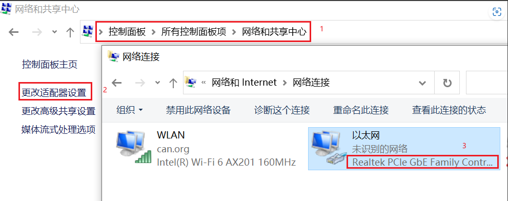
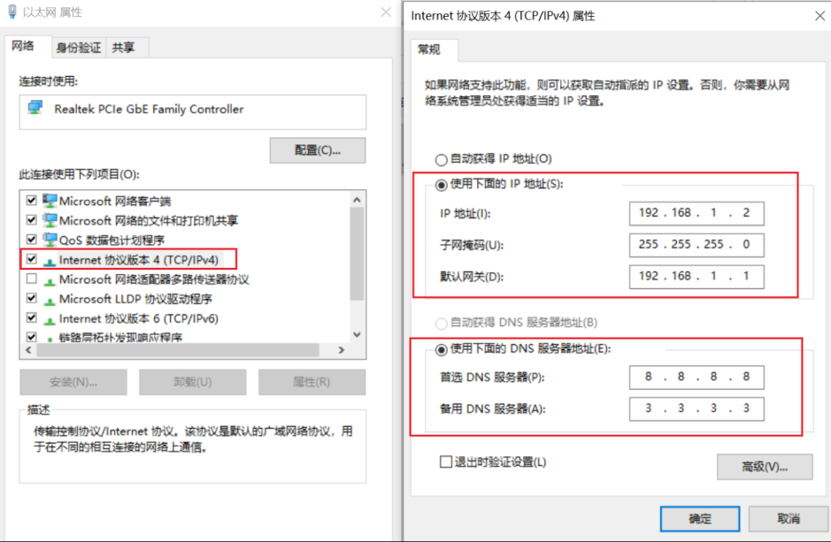
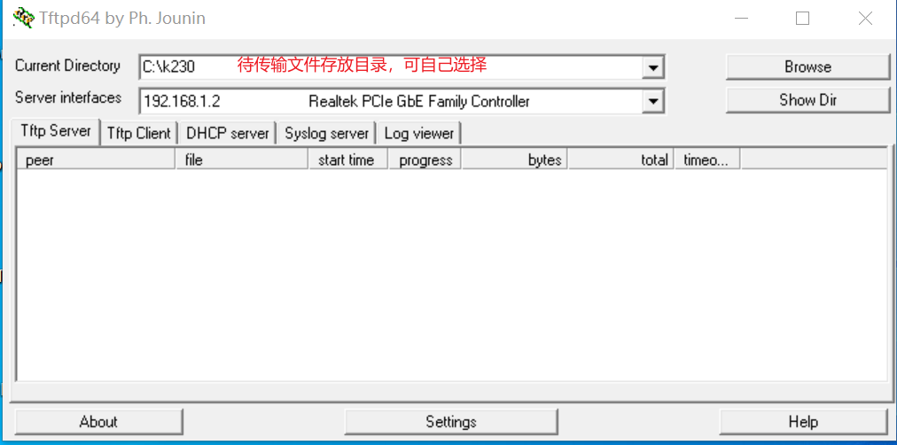

(4) Development Board Network Configuration:

Power on the development board. The power cable, network cable, and COM port connection cable configuration are detailed in the documentation: [K230_SDK_Usage Guide](https://github.com/kendryte/k230_docs/blob/main/zh/01_software/board/K230_SDK_%E4%BD%BF%E7%94%A8%E8%AF%B4%E6%98%8E.md). Open MobaXterm and connect to the development board through two COM serial ports. The COM numbers are not fixed; the smaller number is the little-core serial port, and the larger number is the big-core serial port.

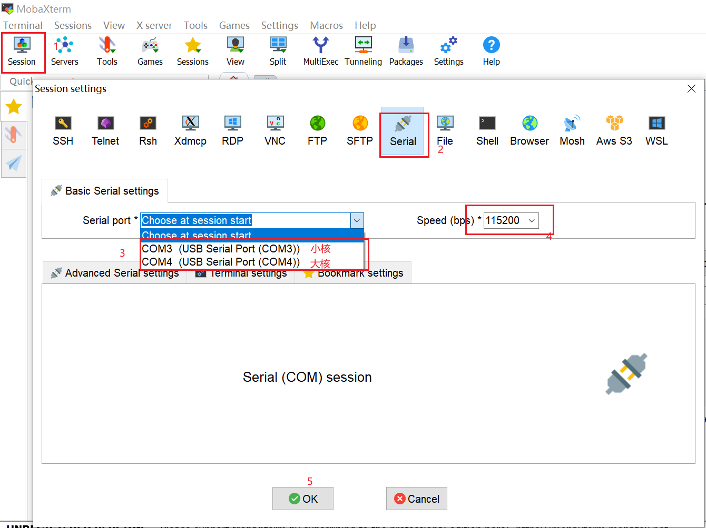

After entering the little-core, press Enter to enter the following interface and log in with root:

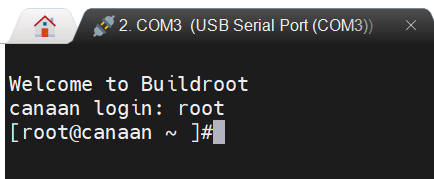

After entering the big-core, press Enter to enter the following interface:

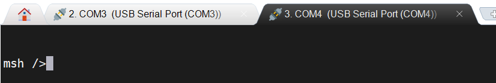

Configure the network on the little-core:

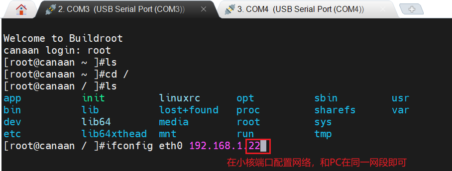

Shared storage area for little-core and big-core: /sharefs

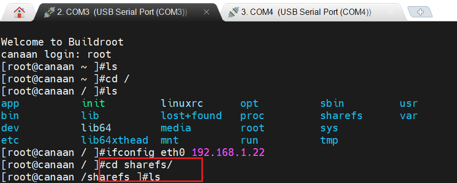

When copying data from files configured in Tftpd64, use the following command on the little-core interface:

```shell
# 192.168.1.2 is the PC's local network IP
tftp -g -r your_file_name 192.168.1.2
```

When copying development board files to the folder configured in Tftpd64 on the PC, use the following command on the little-core:

```shell
# 192.168.1.2 is the PC's local network IP
tftp -p -r your_file_name 192.168.1.2
```

#### Linux System

On Linux systems, the PC is normally connected to the network, and the development board can connect to other network ports under the same gateway as the PC through a network cable to achieve file transfer via scp commands.

Power on the development board and enter the big-core and little-core COM interfaces. Execute scp transfer commands on the little-core:

```
# Copy files from PC to development board
scp username@domain_or_IP:file_directory development_board_destination_directory
# Copy files from development board to PC
scp development_board_file_directory username@domain_or_IP:PC_destination_directory
```

### Code Analysis for On-Board Deployment

After completing the above preparation work for the development board, we can write our own code in C++. Below is an analysis of the sample code for image classification tasks. This tutorial provides sample code for image classification tasks and provides a brief analysis.

#### Code Structure

```
k230_code
├──cmake
    ├──link.lds # Linker script
      ├──Riscv64.cmake
├──k230_deploy
      ├──ai_base.cc # Implementation of model deployment base class
      ├──ai_base.h # Model deployment base class, encapsulates nncase loading, input settings, model inference, and output retrieval operations. Subsequent task development only needs to focus on model preprocessing and postprocessing
      ├──classification.cc # Implementation of image classification code class
      ├──classification.h # Image classification class definition, inherits from AIBase, used to load kmodel for image classification tasks, encapsulates model inference preprocessing and postprocessing
      ├──main.cc # Main function, parameter parsing, initialization of classification class instance, implementation of on-board functionality
      ├──scoped_timing.hpp # Time measurement tool
      ├──utils.cc # Utility class implementation
      ├──utils.h # Utility class, encapsulates common functions for image classification tasks, including reading binary files, saving images, image processing, result drawing, etc. Users can enrich this file according to their needs
      ├──vi_vo.h # Video input/output header file
      ├──CMakeLists.txt # CMake script for building an executable file using C/C++ source files and linking to various libraries
├──build_app.sh # Compilation script, uses cross-compilation toolchain to compile the k230_deploy project
├──CMakeLists.txt # CMake script for building the nncase_sdk project
```

#### Core Code

```cpp
/**
 * @brief AI base class, encapsulates nncase-related operations
 * Mainly encapsulates nncase loading, input settings, execution, and output retrieval. Subsequent development only needs to focus on model preprocessing and postprocessing
 */
class AIBase
{
public:
/**
     * @brief AI base class constructor, loads kmodel and initializes kmodel input and output
     * @param kmodel_file Path to kmodel file
     * @param debug_mode  0 (no debug), 1 (show time only), 2 (show all debug info)
     * @return None
     */
AIBase(const char *kmodel_file,const string model_name, const int debug_mode = 1);

/**
     * @brief AI base class destructor
     * @return None
     */
~AIBase();

/**
     * @brief Set kmodel input
     * @param buf Input data pointer
     * @param size Input data size
     * @return None
     */
void set_input(const unsigned char *buf, size_t size);

/**
     * @brief Get kmodel input tensor by index
     * @param idx Input data pointer
     * @return None
     */
runtime_tensor get_input_tensor(size_t idx);

void set_input_tensor(size_t idx, runtime_tensor &tensor);

/**
     * @brief Initialize kmodel output
     * @return None
     */
void set_output();

/**
     * @brief Run kmodel inference
     * @return None
     */
void run();

/**
     * @brief Get kmodel output, results are saved in corresponding class attributes
     * @return None
     */
void get_output();


protected:
string model_name_;                    // Model name
int debug_mode_;                       // Debug mode, 0 (no print), 1 (print time), 2 (print all)
vector<float *> p_outputs_;            // List of pointers corresponding to kmodel outputs
vector<vector<int>> input_shapes_;     //{{N,C,H,W},{N,C,H,W}...}
vector<vector<int>> output_shapes_;    //{{N,C,H,W},{N,C,H,W}...}} or {{N,C},{N,C}...}} etc.
vector<int> each_input_size_by_byte_;  //{0,layer1_length,layer1_length+layer2_length,...}
vector<int> each_output_size_by_byte_; //{0,layer1_length,layer1_length+layer2_length,...}
private:
/**
     * @brief Initialize kmodel input on first run and get input shape
     * @return None
     */
void set_input_init();

/**
     * @brief Initialize kmodel output on first run and get output shape
     * @return None
     */
void set_output_init();

// kmodel interpreter, built from kmodel file, responsible for model loading, input/output settings, and inference
vector<unsigned char> kmodel_vec_; // Read entire kmodel data from kmodel file for passing to kmodel interpreter to load kmodel
interpreter kmodel_interp_; 
};
```

The above code is the AIBase class definition in the ai_base.h file. It mainly defines the kmodel interpreter, kmodel-related information, and interface definitions for input/output settings and inference processes. The specific implementation is in ai_base.cc.

```cpp
/**
 * @brief Classification task
 * Mainly encapsulates the process from preprocessing, execution, to postprocessing for each image frame
 */
class Classification : public AIBase
{
public:
/**
    * @brief Classification constructor, loads kmodel and initializes kmodel input, output, and classification threshold
    * @param args        Parameters needed for object construction, config.json file (including classification threshold, kmodel path, etc.)
    * @param debug_mode  0 (no debug), 1 (show time only), 2 (show all debug info)
    * @return None
    */
Classification(string &kmodel_path, string &image_path,std::vector<std::string> labels, float cls_thresh,const int debug_mode);

/**
    * @brief Classification constructor, loads kmodel and initializes kmodel input, output, and classification threshold
    * @param args        Parameters needed for object construction, config.json file (including classification threshold, kmodel path, etc.)
    * @param isp_shape   isp input size (chw)
    * @param vaddr       isp corresponding virtual address
    * @param paddr       isp corresponding physical address
    * @param debug_mode  0 (no debug), 1 (show time only), 2 (show all debug info)
    * @return None
    */
Classification(string &kmodel_path, string &image_path,std::vector<std::string> labels,float cls_thresh, FrameCHWSize isp_shape, uintptr_t vaddr, uintptr_t paddr,const int debug_mode);

/**
    * @brief Classification destructor
    * @return None
    */
~Classification();

/**
    * @brief Image preprocessing
    * @param ori_img Original image
    * @return None
    */
void pre_process(cv::Mat ori_img);

/**
    * @brief Video stream preprocessing (ai2d for isp)
    * @return None
    */
void pre_process();

/**
    * @brief kmodel inference
    * @return None
    */
void inference();

/**
    * @brief kmodel inference result postprocessing
    * @param results Classification results based on original image after postprocessing
    * @return None
    */
void post_process(vector<cls_res> &results);

private:

/**
    * @brief Calculate exponential
    * @param x Variable value
    * @return Return result after exponential calculation
    */
float fast_exp(float x);

/**
    * @brief Calculate sigmoid
    * @param x Variable value
    * @return Return result after sigmoid calculation
    */
float sigmoid(float x);

std::unique_ptr<ai2d_builder> ai2d_builder_; // ai2d builder
runtime_tensor ai2d_in_tensor_;              // ai2d input tensor
runtime_tensor ai2d_out_tensor_;             // ai2d output tensor
uintptr_t vaddr_;                            // isp virtual address
FrameCHWSize isp_shape_;                     // isp corresponding address size

float cls_thresh;      // Classification threshold
vector<string> labels; // Category names
int num_class;         // Number of categories

float* output;         // Read kmodel output
};
```

The above code is the class definition for implementing image classification tasks, which mainly defines interfaces for image classification model inference preprocessing, inference, and postprocessing. It initializes the ai2d builder to implement image preprocessing. It also defines some variables for image classification tasks, such as the number of categories, label list, classification threshold, etc. The specific implementation is in classification.cc.

```cpp
void print_usage()
{
    cout << "Model inference parameter explanation:"
        << "<kmodel_path> <image_path> <debug_mode>" << endl
        << "Options:" << endl
        << "  kmodel_path     Path to the Kmodel\n"
        << "  image_path      Image path for inference or camera (None)\n"
        << "  debug_mode      Whether to debug, 0, 1, 2 represent no debug, simple debug, detailed debug respectively\n"
        << "\n"
        << endl;
}

int main(int argc, char *argv[])
{
    std::cout << "case " << argv[0] << " built at " << __DATE__ << " " << __TIME__ << std::endl;
    if (argc < 4)
    {
        print_usage();
        return -1;
    }
    // video
    if (strcmp(argv[2], "None") == 0)
    {
        std::thread thread_isp(video_proc, argv);
        while (getchar() != 'q')
            {
                usleep(10000);
            }

        isp_stop = true;
        thread_isp.join();
    }
        // image
    else
    {
        image_proc(argv);
    }
    return 0;
}
```

The above code is part of the main.cc file, which mainly implements parsing input parameters, printing usage instructions, and implementing two different branches of inference. If the second input parameter is the inference image path, call the image_proc function for image inference; if None is passed, call the video_proc function for video stream inference.

```cpp
vector<string> read_labels_txt(string &labels_txt){
    std::vector<std::string> labels;
    std::ifstream file(labels_txt);
    if (!file.is_open()) {
        std::cerr << "Failed to open the file." << std::endl;
        return labels;
    }
    std::string line;
    while (std::getline(file, line)) {
        // Remove newline character at end of line
        if (!line.empty() && line[line.length() - 1] == '\n') {
            line.erase(line.length() - 1);
        }
        labels.push_back(line);
    }
    file.close();
    return labels;
}


void image_proc_cls(string &kmodel_path, string &image_path,vector<string> labels,float cls_thresh ,int debug_mode)
{
    // Image inference code...
}

void video_proc_cls(string &kmodel_path, string &image_path,vector<string> labels,float cls_thresh , int debug_mode)
{
    // Video stream inference code...
}

int video_proc(char *argv[])
{
    string kmodel_path = argv[1];
    string image_path = argv[2];
    string labels_txt=argv[3];
    int debug_mode = std::stoi(argv[4]);
    vector<string> labels=read_labels_txt(labels_txt);
    float cls_thresh=0.5;
    video_proc_cls(kmodel_path,image_path,labels,cls_thresh,debug_mode);
    return -1;
}

int image_proc(char *argv[])
{   
    string kmodel_path = argv[1];
    string image_path = argv[2];
    string labels_txt=argv[3];
    int debug_mode = std::stoi(argv[4]);
    vector<string> labels=read_labels_txt(labels_txt);
    float cls_thresh=0.5;
    image_proc_cls(kmodel_path,image_path,labels,cls_thresh,debug_mode);
    return -1;
}
```

The above code is part of main.cc, mainly implementing parameter parsing functionality. In image_proc and video_proc, the input parameters are parsed, and the read_labels_txt function is called to read the label name list from the labels.txt file and pass it as parameters to image_proc_cls and video_proc_cls.

```cpp
void image_proc_cls(string &kmodel_path, string &image_path,vector<string> labels,float cls_thresh ,int debug_mode)
{
    cv::Mat ori_img = cv::imread(image_path);
    int ori_w = ori_img.cols;
    int ori_h = ori_img.rows;
    Classification cls(kmodel_path,image_path,labels,cls_thresh,debug_mode);
    cls.pre_process(ori_img);
    cls.inference();
    vector<cls_res> results;
    cls.post_process(results);
    Utils::draw_cls_res(ori_img,results);
    cv::imwrite("result_cls.jpg", ori_img);

}
```

The above code is the image inference code part in main.cc. First, it initializes a cv::Mat object ori_img from the image path, then initializes a Classification instance cls. It calls the cls preprocessing function pre_process, inference function inference, and postprocessing function post_process. Finally, it calls the draw_cls_res function in utils.h to draw the results on the image and save as result_cls.jpg. If you need to modify the preprocessing and postprocessing parts, you can do so in classification.cc. If you want to add other utility methods, you can define them in utils and implement them in utils.cc.

```cpp
void video_proc_cls(string &kmodel_path, string &image_path,vector<string> labels,float cls_thresh , int debug_mode)
{
    vivcap_start();

    k_video_frame_info vf_info;
    void *pic_vaddr = NULL;       //osd

    memset(&vf_info, 0, sizeof(vf_info));

    vf_info.v_frame.width = osd_width;
    vf_info.v_frame.height = osd_height;
    vf_info.v_frame.stride[0] = osd_width;
    vf_info.v_frame.pixel_format = PIXEL_FORMAT_ARGB_8888;
    block = vo_insert_frame(&vf_info, &pic_vaddr);

    // alloc memory
    size_t paddr = 0;
    void *vaddr = nullptr;
    size_t size = SENSOR_CHANNEL * SENSOR_HEIGHT * SENSOR_WIDTH;
    int ret = kd_mpi_sys_mmz_alloc_cached(&paddr, &vaddr, "allocate", "anonymous", size);
    if (ret)
    {
        std::cerr << "physical_memory_block::allocate failed: ret = " << ret << ", errno = " << strerror(errno) << std::endl;
        std::abort();
    }

    Classification cls(kmodel_path,image_path,labels,cls_thresh, {SENSOR_CHANNEL, SENSOR_HEIGHT, SENSOR_WIDTH}, reinterpret_cast<uintptr_t>(vaddr), reinterpret_cast<uintptr_t>(paddr), debug_mode);

    vector<cls_res> results;

    while (!isp_stop)
    {
        ScopedTiming st("total time", debug_mode);

        {
            ScopedTiming st("read capture", debug_mode);
            // VICAP_CHN_ID_1 out rgb888p
            memset(&dump_info, 0 , sizeof(k_video_frame_info));
            ret = kd_mpi_vicap_dump_frame(vicap_dev, VICAP_CHN_ID_1, VICAP_DUMP_YUV, &dump_info, 1000);
            if (ret) {
                printf("sample_vicap...kd_mpi_vicap_dump_frame failed.\n");
                continue;
            }
        }


        {
            ScopedTiming st("isp copy", debug_mode);
            // Read one frame from vivcap to dump_info
            auto vbvaddr = kd_mpi_sys_mmap_cached(dump_info.v_frame.phys_addr[0], size);
            memcpy(vaddr, (void *)vbvaddr, SENSOR_HEIGHT * SENSOR_WIDTH * 3);  // This can be removed later, no need to copy
            kd_mpi_sys_munmap(vbvaddr, size);
        }

        results.clear();

        cls.pre_process();
        cls.inference();

        cls.post_process(results);

        cv::Mat osd_frame(osd_height, osd_width, CV_8UC4, cv::Scalar(0, 0, 0, 0));
        cv::Mat osd_frame_tmp;

        {
            ScopedTiming st("osd draw", debug_mode);
            Utils::draw_cls_res(osd_frame, results, {osd_width, osd_height}, {SENSOR_WIDTH, SENSOR_HEIGHT});
            cv::flip(osd_frame, osd_frame_tmp, 0);
            cv::flip(osd_frame_tmp, osd_frame, 1);
        }


        {
            ScopedTiming st("osd copy", debug_mode);
            memcpy(pic_vaddr, osd_frame.data, osd_width * osd_height * 4);
            // Insert frame to display channel
            kd_mpi_vo_chn_insert_frame(osd_id+3, &vf_info);  //K_VO_OSD0
            printf("kd_mpi_vo_chn_insert_frame success \n");

            ret = kd_mpi_vicap_dump_release(vicap_dev, VICAP_CHN_ID_1, &dump_info);
            if (ret) {
                printf("sample_vicap...kd_mpi_vicap_dump_release failed.\n");
            }
        }
    }

    vo_osd_release_block();
    vivcap_stop();


    // free memory
    ret = kd_mpi_sys_mmz_free(paddr, vaddr);
    if (ret)
    {
        std::cerr << "free failed: ret = " << ret << ", errno = " << strerror(errno) << std::endl;
        std::abort();
    }
}
```

The above code is the part in main.cc for performing classification operations on video streams. Below is a detailed analysis:

- vivcap_start() and vivcap_stop() functions are used to start and stop video capture;

- k_video_frame_info vf_info defines a k_video_frame_info structure variable vf_info to store video frame information;

- void *pic_vaddr = NULL defines a void pointer pic_vaddr to store OSD (On-Screen Display) image data;

- memset(&vf_info, 0, sizeof(vf_info)) initializes the memory of the vf_info structure to zero, then sets the video frame information, including width, height, stride, and pixel format;

- block = vo_insert_frame(&vf_info, &pic_vaddr) calls the vo_insert_frame function to insert frame data; kd_mpi_sys_mmz_alloc_cached function allocates a block of memory to store image data, paddr stores the physical address, vaddr stores the virtual address, and size is the memory block size;

- Create a Classification object cls to implement the classification task;

- Create an empty results vector to store classification results.

- Enter the loop, as long as the isp_stop flag is not true:
  
    a. Use kd_mpi_vicap_dump_frame to get one frame of image data from the video capture device, stored in dump_info;
  
    b. Copy the captured image data to the previously allocated memory block via kd_mpi_sys_mmap_cached and memcpy;
  
    c. Clear the results vector, call the cls preprocessing method, inference method, and postprocessing method to classify the image;
  
    d. Use the classification results to draw classification information on the OSD image;
  
    e. Use memcpy to copy the OSD image data to the previously allocated OSD data block;
  
    f. Insert the OSD image to the display channel via kd_mpi_vo_chn_insert_frame;
  
    g. Release the previously captured image via kd_mpi_vicap_dump_release.

- After the loop ends, release OSD-related resources via vo_osd_release_block() and vivcap_stop() functions;

- Use kd_mpi_sys_mmz_free to release the previously allocated memory block.

Through the above code, video stream inference for image classification tasks is implemented.

#### Code Flowchart

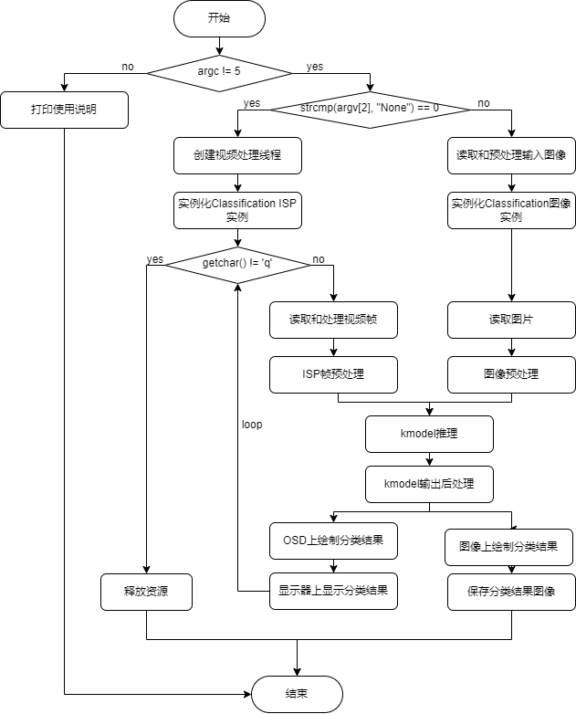

#### Compilation Files

##### k230_code/k230_deploy/CMakeLists.txt

Configure the compilation file, and configure the header file paths and link libraries to be used.

```cmake
set(src main.cc utils.cc ai_base.cc classification.cc)
set(bin main.elf)

include_directories(${PROJECT_SOURCE_DIR})
include_directories(.)

include_directories(${nncase_sdk_root}/riscv64/rvvlib/include)
include_directories(${k230_sdk}/src/big/mpp/userapps/api/)
include_directories(${k230_sdk}/src/big/mpp/include)
include_directories(${k230_sdk}/src/big/mpp/include/comm)
include_directories(${k230_sdk}/src/big/mpp/userapps/sample/sample_vo)
link_directories(${nncase_sdk_root}/riscv64/rvvlib/)

add_executable(${bin} ${src})
target_link_libraries(${bin} -Wl,--start-group rvv Nncase.Runtime.Native nncase.rt_modules.k230 functional_k230 sys vicap vb cam_device cam_engine
 hal oslayer ebase fpga isp_drv binder auto_ctrol common cam_caldb isi 3a buffer_management cameric_drv video_in virtual_hal start_engine cmd_buffer
 switch cameric_reg_drv t_database_c t_mxml_c t_json_c t_common_c vo connector sensor atomic dma -Wl,--end-group)

target_link_libraries(${bin} opencv_imgproc opencv_imgcodecs opencv_core zlib libjpeg-turbo libopenjp2 libpng libtiff libwebp csi_cv)
install(TARGETS ${bin} DESTINATION bin)
```

##### k230_code/CMakeLists.txt

```cmake
cmake_minimum_required(VERSION 3.2)
project(nncase_sdk C CXX)

#add_definitions(-DSTUDIO_HDMI)

set(nncase_sdk_root "${PROJECT_SOURCE_DIR}/../../nncase/")
set(k230_sdk ${nncase_sdk_root}/../../../)
set(CMAKE_EXE_LINKER_FLAGS "-T ${PROJECT_SOURCE_DIR}/cmake/link.lds --static")

# set opencv
set(k230_opencv ${k230_sdk}/src/big/utils/lib/opencv)
include_directories(${k230_opencv}/include/opencv4/)
link_directories(${k230_opencv}/lib ${k230_opencv}/lib/opencv4/3rdparty)

# set mmz
link_directories(${k230_sdk}/src/big/mpp/userapps/lib)


# set nncase
include_directories(${nncase_sdk_root}/riscv64)
include_directories(${nncase_sdk_root}/riscv64/nncase/include)
include_directories(${nncase_sdk_root}/riscv64/nncase/include/nncase/runtime)
link_directories(${nncase_sdk_root}/riscv64/nncase/lib/)

add_subdirectory(k230_deploy)
```

#### k230_code/build_app.sh

```shell
#!/bin/bash
set -x

# set cross build toolchain
export PATH=$PATH:/opt/toolchain/riscv64-linux-musleabi_for_x86_64-pc-linux-gnu/bin/

clear
rm -rf out
mkdir out
pushd out
cmake -DCMAKE_BUILD_TYPE=Release                 \
      -DCMAKE_INSTALL_PREFIX=`pwd`               \
      -DCMAKE_TOOLCHAIN_FILE=cmake/Riscv64.cmake \
      ..

make -j && make install
popd

k230_bin=`pwd`/k230_bin
rm -rf ${k230_bin}
mkdir -p ${k230_bin}

if [ -f out/bin/main.elf ]; then
      cp out/bin/main.elf ${k230_bin}
fi
```

### AI Code Compilation

Copy the k230_code folder from the project to src/big/nncase under the k230_sdk directory, execute the compilation script, and compile the C++ code into a main.elf executable file. If compiling an elf file that can be executed on the CANMV-K230 development board:

```shell
# Execute the following command in the k230_SDK directory to switch to the CanMV development board
make CONF=k230_canmv_defconfig prepare_memory
# Return to the current project directory
./build_app.sh
```

If there are insufficient permissions, you can use the following code to grant relevant permissions:

```shell
chmod +x build_app.sh
./build_app.sh
```

If compiling for the 01Studio development board, switch the development board and compile the code:

```shell
# Execute the following command in the k230_SDK directory to switch to the 01Studio development board
make CONF=k230_canmv_01studio_defconfig prepare_memory
# Return to the current project directory
./build_app.sh
```

The 01Studio development board defaults to compiling in `LCD` display mode. If you want to compile in `HDMI` display mode, uncomment the `add_definitions(-DSTUDIO_HDMI)` in `k230_code/CMakeList.txt`, and then recompile.

### File Transfer

Following the file transfer configuration in section 4 above, on the little-core interface of MobaXterm, enter /sharefs, copy the kmodel file from the checkpoints folder obtained from training, the labels.txt file from the gen folder, and the compiled main.elf file to a newly created project folder test_cls in the sharefs directory of the development board. Also copy an image to be inferred.

```shell
test_cls
├──best.kmodel
├──labels.txt
├──main.elf
├──001.jpg
```

### Model On-Board Execution

Execute main.elf on the big-core COM port interface to implement image classification.
For static image inference, execute the following code (Note: the code needs to be executed on the big-core, file copying needs to be done on the little-core):

```shell
# Model inference parameter explanation:
# "<kmodel_path> <image_path> <labels_txt> <debug_mode>"
# Options:
# "  kmodel_path     Path to the Kmodel\n"
# "  image_path      Image path for inference or camera (None)\n"
# "  labels_txt      Path to category label file\n"
# "  debug_mode      Whether to debug, 0, 1, 2 represent no debug, simple debug, detailed debug respectively\n"
main.elf best.kmodel 001.jpg labels.txt 2 
```

For camera video stream inference, execute the following code:

```shell
main.elf best.kmodel None labels.txt 2 
```

### On-Board Deployment Results

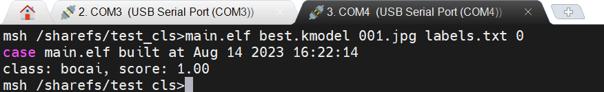

## Tools

Flash tool balena Etcher: [https://etcher.balena.io/](https://etcher.balena.io/)

Local network file transfer tool Tftpd64: [https://bitbucket.org/phjounin/tftpd64/downloads/](https://bitbucket.org/phjounin/tftpd64/downloads/)

MobaXterm download: [https://mobaxterm.mobatek.net/download.html](https://mobaxterm.mobatek.net/download.html)

## References

k230_sdk github: [https://github.com/kendryte/k230_sdk](https://github.com/kendryte/k230_sdk)

k230_sdk_doc github: [k230 sdk usage guide](https://github.com/kendryte/k230_docs/blob/main/zh/01_software/board/K230_SDK_%E4%BD%BF%E7%94%A8%E8%AF%B4%E6%98%8E.md)

k230_sdk gitee: [https://gitee.com/kendryte/k230_sdk](https://gitee.com/kendryte/k230_sdk)

nncase github: [kendryte/nncase: Open deep learning compiler stack for Kendryte AI accelerator (github.com)](https://github.com/kendryte/nncase)
